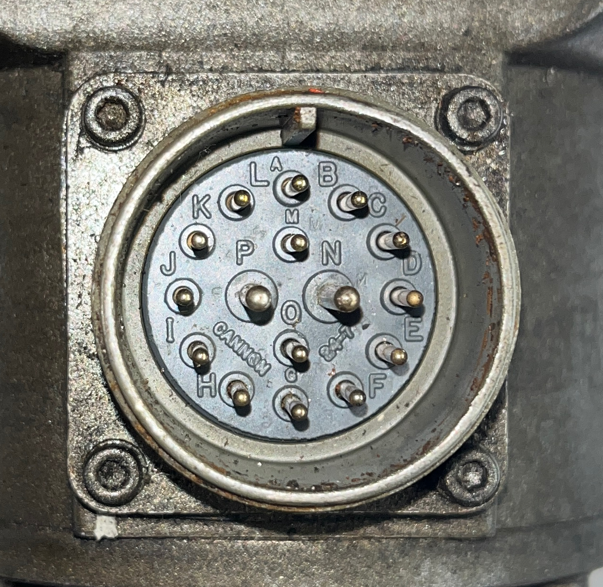

# Axis Servo Motor — Baldor MTE-4535-SPECIAL

Reference document for the Hurco Hawk 5M retrofit (LinuxCNC + Mesa 7i97).

**Status legend — every claim in this document carries one:**

| Tag | Meaning |
|---|---|
| ✅ **FACT** | Directly observed on our hardware, or read off our own nameplate. Trust it. |
| 🟡 **PROBABLE** | Inferred from the motor family, published specs, or corroborating sources. Verify before wiring. |
| ❓ **UNKNOWN** | Not yet determined. Placeholder for future measurement. |

Last updated: 2026-07-25

**Confirmed so far:** nameplate data (§1); connector is **MS3102A-24-7P**, mate is
**MS3106A-24-7S** (§4.2); full face layout — 16 contacts A–P, keyway at 12 o'clock, pin A
beneath it, lettering clockwise (§4.1); **centre group fully mapped — armature on N/P,
tachometer on M/O** (§5.3), with P positive giving counter-clockwise rotation and M
positive when counter-clockwise (§5.4); motor runs and tach output matches nameplate within
1% (§6 steps 2–3); belt drive, no gearbox (§7).

**Remaining:** the twelve outer-ring contacts A–L (encoder, thermostat, shields).

---

## 1. Nameplate data

✅ **FACT** — transcribed from `docs/servo-sticker-actual.jpg` (our motor). The sticker is
worn but legible.

| Field | Value |
|---|---|
| Manufacturer | Baldor, DC Servomotor, Fort Smith AR, Made in USA |
| Cat. No. | `MTE-4535-SPECIAL` |
| Spec. No. | `FME0204B-00` |
| Mfg. Code | `S12/94` (Dec 1994) |
| Torque, stall | 40 lb-in continuous (4.52 N·m) |
| Max speed | 4500 RPM |
| Max voltage | 180 V<sub>DC</sub> |
| Voltage const. | K<sub>e</sub> = 32.0 V/kRPM |
| Current, cont. | 16.4 A |
| Current, peak | 70.2 A |
| Insulation | Class F, 25 °C ambient |
| Tachometer | 7.00 V/kRPM |
| Encoder | **2500 L** (2500 lines) |

### Comparison to `docs/servo-sticker-example.jpg`

The example sticker is the *same motor family and same build month* but **not** the same
part. Two fields differ:

| Field | Ours (actual) | Example |
|---|---|---|
| Spec. No. | `FME0204B-00` | `FME0153B-00` |
| Encoder | **2500 L** | 500 L |

⚠️ The encoder line count is the field that matters most for LinuxCNC scaling. **Ours is
2500 L.** Do not use the example sticker for this value.

### Derived values

✅ **FACT** (arithmetic from nameplate):

- Encoder resolution in quadrature: 2500 × 4 = **10,000 counts per motor revolution**
- Torque constant K<sub>t</sub> ≈ 32.0 V/kRPM → ≈ 0.305 N·m/A ≈ 2.70 lb-in/A
- Continuous torque check: 16.4 A × 2.70 ≈ 44 lb-in — consistent with the 40 lb-in rating
- Back-EMF at max speed: 4.5 kRPM × 32.0 V/kRPM = **144 V** — which is why the drive bus
  is rated 180 V

🟡 **PROBABLE** — the motor is a brush-type (brushed) DC servo with a mechanically
commutated armature, an integral DC tachogenerator, and a rear-mounted incremental
encoder. Supported by: the M4500 series designation, the presence of a tach spec, and a
teardown writeup for this same machine describing removable brush access plates and a
rear cap over the encoder.

---

## 2. Theory of operation

This section describes what physically enters and leaves the motor, and how the control
loops around it close. Everything here is 🟡 **PROBABLE** at the level of *which pin*
carries a signal (see §5), but ✅ **FACT** at the level of *which signals exist* — each is
either named on our nameplate or is structurally required by a brushed DC servo.

### 2.1 What the motor is

A brushed DC servomotor converts DC armature current into shaft torque, essentially
linearly: **torque ≈ K<sub>t</sub> × current**. It is not a stepper and has no intelligence
of its own. It has no idea where it is. Left unpowered it freewheels; left powered with a
constant voltage it accelerates until back-EMF balances the applied voltage. All
positioning intelligence lives outside the motor, in the drive and the control.

Bolted to that armature are two passive sensors that report what the shaft is doing: a
**tachogenerator** (analog speed) and an **incremental encoder** (digital position
change). The motor's whole job is to accept current and report motion.

### 2.2 Inputs to the motor

| Input | Nature | Magnitude | Source |
|---|---|---|---|
| **Armature power** | Bidirectional DC, high current | 0–180 V, 16.4 A cont., 70.2 A peak | SD1525 drive output stage |
| **Encoder supply** | Regulated logic power | +5 V DC, low current | Drive or control cabinet 5 V rail |

That is all. Two power inputs — one big, one small. Nothing else is *commanded* at the
motor; there are no digital inputs, no configuration, no enable line at the motor itself.

**Armature polarity sets direction.** ✅ **FACT** — confirmed on our motor: with pin **P**
positive relative to pin **N**, the shaft turns **counter-clockwise viewed from the shaft
end** (the face the output shaft emerges from). Reversing the supply reverses rotation.
**Armature current sets torque**, and the drive regulates that current
continuously — it is not a fixed voltage. During a rapid acceleration the drive may push
toward the 70.2 A peak for a short interval; during steady cutting it settles far below
the 16.4 A continuous limit.

**Four-quadrant operation.** The drive can both motor and brake in either direction. When
decelerating an axis, the motor acts as a generator and pushes energy *back* into the
drive. This is normal and expected, and is why the drive has a regen/shunt provision.

### 2.3 Outputs from the motor

| Output | Nature | Scaling | Consumed by |
|---|---|---|---|
| **Shaft torque / rotation** | Mechanical | ≈ 2.70 lb-in per amp | Timing belt → ballscrew → table |
| **Tachometer voltage** | Analog DC, bipolar | 7.00 V per 1000 RPM, M positive w.r.t. O when CCW | SD1525 velocity loop |
| **Encoder A / /A** | Differential square wave | 2500 cycles/rev | Mesa 7i97 → LinuxCNC |
| **Encoder B / /B** | Differential square wave, 90° from A | 2500 cycles/rev | Mesa 7i97 → LinuxCNC |
| **Encoder Z / /Z** | Differential index pulse | 1 per rev | LinuxCNC homing |
| **Thermostat contact** | Dry contact, normally closed | opens when hot | Drive fault input (🟡 presence unconfirmed) |

**The tachometer** is a small DC generator on the same shaft. Its output voltage is
proportional to speed and its *polarity* indicates direction — spin the shaft one way and
it reads positive, the other way negative. At 1000 RPM it produces 7.00 V. It is entirely
passive; it needs no supply and works whenever the shaft turns, including when the machine
is powered down. This is the property that makes it useful for the bench identification
procedure in §6.

**The encoder** reports *change*, not absolute position. A and B are square waves 90° out
of phase; the control counts edges to know how far the shaft moved, and infers direction
from which channel leads. With 2500 lines and 4× quadrature decoding this yields **10,000
counts per motor revolution**. Each channel also has a complement (/A, /B, /Z) so the
receiver can read the *difference* between the pair and reject electrical noise picked up
along the cable run — important given that 70 A of armature switching shares the same
connector shell.

**Z (index)** fires exactly once per shaft revolution. LinuxCNC uses it to home to a
precisely repeatable point rather than relying on the limit switch alone.

Note that the encoder outputs are relative and **volatile**: on power-up the control has no
idea where the axis is until homing establishes a reference.

### 2.4 The two nested control loops

```
                 ┌──────────────── OUTER: POSITION LOOP (digital, LinuxCNC) ────────────────┐
                 │                                                                          │
  G-code ──► LinuxCNC ──► Mesa 7i97 ──► ±10 V ──► SD1525 ──► armature ──► MOTOR ──► belt ──► ballscrew ──► TABLE
  planner       PID                      command    drive      current      │
                 ▲                                    ▲                     │
                 │                                    │  tach voltage       │
                 │                                    └─────────────────────┤  INNER: VELOCITY LOOP
                 │                                       (analog, in drive) │  (analog, SD1525)
                 │                                                          │
                 └──────────────── encoder A/B/Z ◄───────────────────────────┘
```

**Inner loop — velocity, closed by the drive, in analog hardware.**
The SD1525 receives a ±10 V command meaning "run at this speed, this direction". It
compares that command against the tachometer voltage coming back from the motor and drives
armature current to null the difference. This loop is fast, runs entirely in the drive, and
LinuxCNC has no visibility into it. If the axis is loaded and slows, the tach reports the
sag and the drive pushes more current — automatically.

**Outer loop — position, closed by LinuxCNC, in software.**
LinuxCNC's motion planner produces a commanded position every servo period. It compares
that to the actual position derived from encoder counts, and its PID converts the error
into the ±10 V velocity command sent down to the drive. Following error is the difference
between where the axis should be and where the encoder says it is.

**Why this split matters for tuning.** There are two sets of gains, in two different
places. The drive has trimpots (velocity loop gain, balance/offset, current limit); the
motor tuning in LinuxCNC's HAL has P/I/D plus feed-forward. **The drive must be trimmed
first** — get the analog velocity loop stable and the offset nulled so that 0 V command
produces zero drift — and only then tune the LinuxCNC PID on top. Chasing the outer loop
while the inner one is mis-trimmed produces confusing results.

### 2.5 Where the loop does *not* reach

⚠️ The encoder is mounted on the **motor** shaft, upstream of the timing belt. The control
therefore measures motor rotation, not table position. Everything downstream of the
encoder — belt stretch, tooth backlash, pulley-bushing slip, ballscrew wear, ballnut
backlash — is **outside the loop and invisible to LinuxCNC**. The servo will faithfully
report zero following error while the table sits in the wrong place.

This is inherent to the design (a rotary-encoder retrofit, not linear scales). It means:

- Mechanical condition of the belt, bushings, screw and thrust bearings directly limits
  achievable accuracy; no amount of PID tuning compensates.
- Backlash measured at the table is a real, uncorrectable error unless entered as a
  compensation value.
- A slipping pulley bushing produces silent, cumulative position loss with **no fault** —
  the control cannot detect it. Homing to index each session bounds the damage.

### 2.6 Failure modes worth recognising

🟡 **PROBABLE** — characteristic of this motor type, not yet observed on our units:

- **Worn brushes** — intermittent torque, arcing, growling under load. Brushes are
  serviceable through the access plates on the motor body.
- **Commutator glazing / carbon buildup** — erratic low-speed behaviour, elevated current.
- **Tach failure** — the inner loop loses its feedback and the axis runs away at full
  speed the instant it is enabled. Dangerous. Test the tach before first power-on.
- **Encoder noise** — phantom counts, following-error faults that appear only during rapids
  or when the spindle runs. Almost always a shielding or grounding problem, not a bad
  encoder.

---

## 3. Corroborating source

🟡 **PROBABLE (strong)** — A LinuxCNC forum member retrofitting the same machine
(Hurco Hawk 5M) posted a nameplate reading `MTE-4535-SPECIAL`, `FME0204B-00`, 2500 L
encoder, 7.0 V tach — an **exact match to our spec number and encoder count**. His mfg
code was `S3/94` vs our `S12/94`, i.e. a different production month of the same part.

This means mechanical and electrical findings from that thread are likely to apply to our
motors, but they are second-hand and are tagged PROBABLE throughout this document.

⚠️ **Pinout information from that thread does not apply.** The connector documented there
is a 14-pin MS3102E-20-27P with uniform contact sizes. Ours is a **16-pin connector with
two oversized centre contacts** (§4). Different part, different arrangement — either an
error, or documentation for a replacement motor rather than the original. Do not carry any
letter assignment across.

Reference: LinuxCNC Forum, "Hurco Hawk 5M Retrofit w/ existing motors" (thread 34316).

---

## 4. Connector — physical description

✅ **FACT** — observed on our motor:

- **MS3102A-24-7P** male (pin) bulkhead receptacle on the motor body, four-bolt square
  flange; insert moulded **CANNON** (§4.2)
- 16 contacts: **12 in the outer ring, 4 in the centre**
- Of the centre 4, **2 are noticeably larger diameter** — N and P
- Contacts lettered **A through P**, all 16 letters, I and O included
- **Keyway at the 12 o'clock position**

### 4.1 Face layout

✅ **FACT** — from `docs/servo-connector.jpg`.



**Lettering runs clockwise from the keyway, outer ring first (A–L), then the inner group
(M–P).** Viewed face-on from outside the motor, looking at the pins:

```
                       KEYWAY
                          ▼
                L         A         B

          K                                   C

                          M
       J             (P)     (N)                 D          (P) (N) = oversized
                          O                                       = armature

          I                                   E

                H         G         F
```

| Ring | Contact | Clock position | Size |
|---|---|---|---|
| Outer | A | 12:00 (under keyway) | std |
| Outer | B | 1:00 | std |
| Outer | C | 2:00 | std |
| Outer | D | 3:00 | std |
| Outer | E | 4:00 | std |
| Outer | F | 5:00 | std |
| Outer | G | 6:00 | std |
| Outer | H | 7:00 | std |
| Outer | I | 8:00 | std |
| Outer | J | 9:00 | std |
| Outer | K | 10:00 | std |
| Outer | L | 11:00 | std |
| Inner | M | 12:00 | std |
| Inner | **N** | 3:00 | **large** |
| Inner | O | 6:00 | std |
| Inner | **P** | 9:00 | **large** |

**Orientation reference:** pin **A sits directly below the keyway**. This is the anchor for
assembling the mating plug — get it wrong and the whole map rotates.

⚠️ The mating MS3106A-24-7S plug (female) is **mirror-imaged**: lettering runs
counter-clockwise from its keyway. Always confirm which half you are reading — the diagram
above is the motor receptacle.

The armature landing on N and P is a convenient mnemonic (Negative / Positive), but it is
incidental — those are simply the letters at those two positions in the clockwise sequence.

**Consequence for §5:** the two standard-size *centre* contacts are now identified as
**M** and **O**. These are the probable tachometer pair.

### 4.2 Connector identification

✅ **FACT** — identified:

| Half | Part number | Description |
|---|---|---|
| **On the motor** | **MS3102A-24-7P** | Box/wall-mount receptacle, shell size 24, insert arrangement 7, **P = pin (male) contacts** |
| **Cable end (needed)** | **MS3106A-24-7S** | Straight plug, shell size 24, insert arrangement 7, **S = socket (female) contacts** |

Amphenol or any compatible manufacturer — this is a MIL-DTL-5015 standard part, so
Amphenol, ITT Cannon, Bendix, Matrix and others interchange. The insert on our motors is
moulded **CANNON**.

The 24-7 arrangement provides the 16 contacts in two sizes that we observe: 14 standard
plus the 2 oversized armature contacts (N and P).

**Ordering notes**

🟡 **PROBABLE — verify before ordering contacts.** Arrangement 24-7 is understood to use
**#12 contacts** for the two large positions and **#16 contacts** for the other fourteen.
Crimp contacts are normally ordered *separately* from the shell, in the correct size and
gender, and each size needs its own crimp tool and positioner. Confirm sizes against the
supplier's arrangement drawing before placing the order.

🟡 Current rating sanity check: #12 contacts are typically rated around 23 A continuous,
comfortably above the motor's 16.4 A continuous armature rating. The 70.2 A peak is brief
and intermittent, which is what the contacts are sized for. #16 contacts at roughly 13 A
are far beyond anything the signal circuits draw.

⚠️ Also specify a **backshell / cable clamp** (MS3057-series or equivalent for shell 24).
Given the noise concerns in §7, use a shielded backshell that bonds the cable shield to
the connector shell through 360°, not a pigtail.

⚠️ **P and S are pins and sockets, not polarity.** Do not confuse the `-P` / `-S` suffix
with the armature pin lettering. Ordering two `-P` halves is a common and annoying mistake.

---

## 5. Pin functions

### 5.1 Signal inventory — what the 16 conductors must carry

🟡 **PROBABLE** — the signals described in §2 map to conductors as follows. This adds to
15–16, which is why the connector has 16 pins.

| Function group | Conductors | Signals |
|---|---|---|
| Armature | 2 | A1, A2 |
| Tachometer | 2 | TACH+, TACH− |
| Encoder power | 2 | +5 V, encoder common |
| Encoder channels | 6 | A, /A, B, /B, Z (index), /Z |
| Thermostat | 2 | Normally-closed thermal switch |
| Shield / chassis | 1–2 | Cable shield and/or case ground |

**Confidence varies by group:**

- Armature (2) — ✅ **FACT.** Confirmed by measurement: pins **P** and **N**, the two
  oversized centre contacts (§5.3).
- Encoder (8) — 🟡 **PROBABLE, very high.** A 2500 L encoder with complementary outputs
  has no other plausible conductor count.
- Tach (2) — ✅ **FACT.** Pins **M** and **O**, confirmed by calibrated spin test
  (§6 step 3).
- Thermostat (2) — 🟡 **PROBABLE, moderate.** Common on Baldor DC servos of this vintage
  and the SD1525 drive has a fault input, but **not confirmed present on our motor.**
- Shield / chassis (1–2) — 🟡 **PROBABLE, moderate.** Separate encoder-shield and
  tach-shield conductors are plausible rather than one common shield.

❓ **Alternative possibilities for the last 2–3 positions** (in rough order of likelihood):

1. Two separate shield conductors (encoder shield, tach shield) rather than thermostat.
2. Simply unused / spare — Baldor used one connector across several option combinations.
3. Separate encoder-common and signal-ground returns rather than a single common.
4. A brake pair — **unlikely**, since a brake would make this an MTE**B**-4535 and our
   nameplate reads MTE-4535.

### 5.2 Position grouping

| Physical position | Pins | Contents | Status | Reasoning |
|---|---|---|---|---|
| Centre, oversized | **N, P** | **Armature** | ✅ **FACT** | Measured and spin-tested (§6 steps 1–2) |
| Centre, standard | **M, O** | **Tachometer** | ✅ **FACT** | Calibrated spin test (§6 step 3) |
| Outer ring | **A–L** | **Encoder (8), thermostat and/or shields (2–4)** | 🟡 PROBABLE | Only signals remaining; low-level circuits kept away from the armature contacts |

**The centre group is fully resolved:** armature on the two oversized contacts (N, P) and
the tachometer on the two standard ones (M, O). The assumed layout principle — power and
velocity-loop signals in the centre, everything else on the outer ring — is now confirmed
rather than inferred, which raises confidence that all twelve encoder, thermostat and
shield conductors are on the outer ring A–L.

### 5.3 Letter-to-function assignment

**4 of 16 confirmed — the entire centre group.** No published pinout for this connector
exists; it is absent from Baldor/ABB documentation, the M4500 catalog, and public forums,
and multiple people have searched without success. The remaining twelve (outer ring A–L)
are being established empirically.

**Do not wire from this table until the Status column reads FACT.**

| Pin | Position | Size | Function | Status | Verified how | Date |
|---|---|---|---|---|---|---|
| A | outer 12:00 | std | encoder / shield / thermostat | ❓ | | |
| B | outer 1:00 | std | encoder / shield / thermostat | ❓ | | |
| C | outer 2:00 | std | encoder / shield / thermostat | ❓ | | |
| D | outer 3:00 | std | encoder / shield / thermostat | ❓ | | |
| E | outer 4:00 | std | encoder / shield / thermostat | ❓ | | |
| F | outer 5:00 | std | encoder / shield / thermostat | ❓ | | |
| G | outer 6:00 | std | encoder / shield / thermostat | ❓ | | |
| H | outer 7:00 | std | encoder / shield / thermostat | ❓ | | |
| I | outer 8:00 | std | encoder / shield / thermostat | ❓ | | |
| J | outer 9:00 | std | encoder / shield / thermostat | ❓ | | |
| K | outer 10:00 | std | encoder / shield / thermostat | ❓ | | |
| L | outer 11:00 | std | encoder / shield / thermostat | ❓ | | |
| **M** | inner 12:00 | std | **Tachometer** (positive when shaft turns CCW) | ✅ **FACT** | Calibrated spin test at 6 V and 12 V; output matched 7.00 V/kRPM and reversed with direction (§6 step 3) | 2026-07-25 |
| **N** | inner 3:00 | **large** | **Armature −** | ✅ **FACT** | Oversized centre contact; low-Ω commutator-varying resistance to P; dynamic-braking check; powered spin test | 2026-07-25 |
| **O** | inner 6:00 | std | **Tachometer** (reference / return for M) | ✅ **FACT** | as above | 2026-07-25 |
| **P** | inner 9:00 | **large** | **Armature +** (positive → CCW at shaft end) | ✅ **FACT** | as above | 2026-07-25 |

The Function column shows the *candidate* role from §5.2 where one exists. Those entries
are 🟡 PROBABLE and remain ❓ in Status until measured.

**4 of 16 confirmed.** All four centre contacts are now established: armature on N/P,
tachometer on M/O.

### 5.4 Rotation and polarity convention

✅ **FACT** — all directions stated **viewed from the shaft end** (the face the output
shaft emerges from):

| Condition | Result |
|---|---|
| P positive w.r.t. N | Shaft turns **counter-clockwise** |
| N positive w.r.t. P | Shaft turns **clockwise** |
| Shaft turning counter-clockwise | **M positive** w.r.t. O |
| Shaft turning clockwise | **M negative** w.r.t. O |

**Armature and tach polarity are consistent with each other.** Driving P positive turns the
shaft CCW, and CCW makes M positive. So a positive armature drive produces a positive tach
reading on the same sense — M pairs with P, O pairs with N.

⚠️ This is the relationship the SD1525 velocity loop depends on. The loop requires
*negative* feedback: the tach signal must oppose the command. If the tach pair is landed
backwards at the drive, the loop becomes positive feedback and the axis runs away at full
speed the instant it is enabled (§2.6). Getting M/O the right way round at the drive
terminals is a safety item, not a preference.

❓ **UNKNOWN** — which of M / O lands on the drive's TACH+ terminal. That depends on the
SD1525's internal sense, not on the motor. Determine from the drive manual or by careful
low-speed test with the axis mechanically free. See §8 question 11.

**Axis direction** — CCW-at-the-motor does not yet map to +X / +Y / +Z. That requires the
belt arrangement and ballscrew hand for each axis. See §8 question 10.

---

## 6. Verification procedure

Run in this order. Steps 1, 4 and 5 energize nothing.

**1. Armature — identify the two oversized centre pins** ✅ **COMPLETE — pins P and N**
Ohmmeter across them reads a fraction of an ohm to a few ohms, and the reading shifts as
the shaft is rotated by hand (commutator segments). Confirm by shorting the pair: the
shaft becomes noticeably harder to turn (dynamic braking). No other pair does this.

> ⚠️ **Do not skip this before step 2.** Applying supply voltage to the tach pins
> back-drives that small generator as a motor and can damage it. Applying it to encoder
> pins destroys the encoder instantly.

**2. Powered spin test — armature only** ✅ **COMPLETE — motor spins; P positive → CCW**

✅ Valid: this is a brushed DC motor. Armature voltage alone makes it turn. No drive, no
commutation electronics, no encoder or tach connection required. Every other pin is left
floating, which is harmless. This confirms brushes and commutator are alive before any
money goes into cable fabrication.

*Setup*

- Current-limited bench supply, **low voltage**. 12 V is the sensible starting point;
  nothing on the bench needs more than 24 V.
- Set the current limit to **3–5 A**. Unloaded draw is small (friction and windage, likely
  under 2 A), but armature resistance is a fraction of an ohm, so instantaneous inrush at
  connection is limited only by that resistance — tens of amps if the supply permits. With
  a limit set, the supply simply folds back and the motor accelerates more slowly. No harm.
- Use a switch rather than touching leads together, to avoid arcing the contacts.

*Expected free-run speed*, from K<sub>e</sub> = 32.0 V/kRPM (speed ≈ V ÷ 32 kRPM):

| Supply | Approx. free-run speed | Expected tach output |
|---|---|---|
| 6 V | ~190 RPM | ~1.3 V |
| 12 V | ~375 RPM | ~2.6 V |
| 24 V | ~750 RPM | ~5.3 V |

*Safety*

- **Clamp or vise the motor before applying power.** 40 lb-in of stall torque will throw a
  loose motor off the bench.
- **Remove or tape the shaft key.** A key flung from a spinning keyway is a projectile.
- Tape over or plug the connector face so the unused pins cannot touch anything conductive.

*What to observe*

- Reversing supply polarity reverses rotation. Expected, not a fault.
- Shorting the armature leads brakes the motor hard — same dynamic-braking effect as step 1.
- Smooth and quiet is good. Growling, visible arcing at the brush plates, or torque that
  comes and goes indicates worn brushes or a glazed commutator. Both are serviceable
  through the access plates on the motor body (§2.6).
- These motors have been sitting since 1994. Run a few minutes at low voltage to seat the
  brushes before judging condition.

*Record in §8:* supply voltage used, steady-state current draw, observed condition.

✅ **Result (2026-07-25):** motor spins on armature power alone. **Pin P positive relative
to pin N produces counter-clockwise rotation viewed from the shaft end.** Tested at 6 V and
12 V. Steady-state current draw, per-motor condition and which unit(s) were tested still to
be logged — see §8 question 9.

**3. Tachometer** ✅ **COMPLETE — pins M and O**

Confirmed by calibrated spin test: the motor was driven from the armature at known supply
voltages (step 2) and the tach output measured with the voltmeter **+ on M, − on O**.

| Supply | Rotation (at shaft end) | Measured M–O | Predicted speed (V ÷ 32) | Implied speed (V<sub>tach</sub> ÷ 7.00) |
|---|---|---|---|---|
| 6 V | clockwise | **−1.3 V** | 188 RPM | 186 RPM |
| 12 V | clockwise | **−2.6 V** | 375 RPM | 371 RPM |
| 6 V | counter-clockwise | **+1.3 V** | 188 RPM | 186 RPM |
| 12 V | counter-clockwise | **+2.6 V** | 375 RPM | 371 RPM |

**Why this is conclusive, not merely suggestive:**

- Output is **linear** in supply voltage — doubling 6 V to 12 V doubles 1.3 V to 2.6 V.
- Output **reverses sign with direction** and holds the same magnitude. Nothing else on the
  connector behaves this way.
- Magnitudes agree with the nameplate to within ~1%. Measured ratio V<sub>tach</sub>/V<sub>supply</sub>
  = 0.217 against a theoretical K<sub>tach</sub>/K<sub>e</sub> = 7.00/32.0 = 0.219. The ~1%
  shortfall is exactly the small speed droop expected from armature IR drop plus bearing and
  brush friction at no load.

This single test **cross-validates three nameplate figures at once** — K<sub>e</sub> = 32.0
V/kRPM, tach = 7.00 V/kRPM, and the pin identification — because each was predicted from
the others before measurement.

**Polarity:** M is positive with respect to O when the shaft turns **counter-clockwise**,
which is the same direction produced by driving P positive. See §5.4.

> ⚠️ Probe carefully. Meter leads slipping across adjacent pins while the armature is
> energized is the one way this test causes damage.

**4. Thermostat**
A pair reading near 0 Ω at room temperature, with no continuity elsewhere and no output
when the shaft is spun. If no such pair exists, those positions are spares or shields —
record that finding, it shrinks the cable.

**5. Encoder — trace, do not probe**
Remove the rear cap, read the encoder module's own part number, pull its datasheet, then
ring out each encoder lead to its connector pin with a continuity tester.

> ⚠️ Do not guess which pin is +5 V. Applying 5 V to a differential output pin will
> destroy the encoder, and these are not cheaply replaced.

**6. Powered encoder check — only after step 5**
Apply current-limited +5 V to the *verified* supply pins and scope A, /A, B, /B, Z, /Z
while turning the shaft by hand. Confirm A and B are 90° apart and that Z fires once per
revolution.

### Faster alternative

🟡 The Servo Dynamics SD1525 drives already in the machine cabinet are wired to these
motors. Ringing out from the labelled drive terminal strips back to the motor connector
yields the complete map with no guessing. See `docs/ServoDynamics_1525.pdf`.
Original Hurco machine wiring diagrams, if available, are faster still.

---

## 7. Mechanical context

✅ **FACT** — motor drives the axis through a **toothed timing belt**, not a gearbox. The
servo sits on a slotted tension plate above the ballscrew end; loosening four bolts and
sliding the motor up slacks the belt. Pulleys are retained by double-taper conical lock
bushings (four bolts in the face), with no keyway and no timing marks. X and Y are
identical in this respect.

🟡 **PROBABLE** — a reduction ratio (not 1:1) is present, most likely 2:1 or 3:1.
Reasoning: 4500 RPM is far more motor speed than the axis needs, and a reduction both
lowers screw RPM to a sane range and multiplies torque at the screw.

❓ **UNKNOWN — measure both:**

- Pulley tooth counts. Ratio = screw pulley teeth ÷ motor pulley teeth.
- Ballscrew lead. Mark the table, rotate the screw exactly 10 turns by hand, measure
  travel, divide by 10.

**LinuxCNC scale, once both are known:**

```
counts/inch = 10000 × ratio ÷ lead(inches)
```

Example only — 2:1 with a 0.200″ lead gives 100,000 counts/inch. **Do not use this number
until measured.** Verify empirically by jogging a known distance against a dial indicator.

### Retrofit notes

🟡 The original drives are Servo Dynamics **SD1525** analog velocity-mode units, custom-built
for Hurco (schematics dated 1992). They accept a ±10 V command. This suits LinuxCNC well
and permits homing to encoder index and disabling drives without losing position.

⚠️ **Wiring hygiene.** 70 A peak armature switching shares a connector shell with 5 V
differential encoder pairs. Keep the encoder pairs shielded and physically separated from
armature leads for the whole cable run, or expect phantom counts.

⚠️ **Tach polarity at the drive is a safety item.** The tach itself is verified good
(§6 step 3), but the inner velocity loop needs *negative* feedback. If M and O are landed
backwards at the SD1525, the loop becomes positive feedback and the axis runs away at full
speed the moment it is enabled (§2.6, §5.4). Confirm the drive's expected sense before
first power-on, and make that first test with the axis mechanically free and a hand on the
E-stop.

---

## 8. Open questions

| # | Question | Blocks |
|---|---|---|
| 2 | Remaining 12 letter-to-function assignments on the outer ring A–L (§5.3) — 4 of 16 confirmed | Cable fabrication |
| 3 | Confirm contact sizes for arrangement 24-7 (believed #12 / #16) and obtain matching crimp tooling (§4.2) | Ordering contacts, cable assembly |
| 4 | Is a thermostat actually present, or are those positions shields? | Conductor count, drive fault wiring |
| 5 | Encoder module make/model under rear cap | Supply voltage, output type |
| 6 | X and Y pulley tooth counts | LinuxCNC scale |
| 7 | Ballscrew lead | LinuxCNC scale |
| 8 | SD1525 trimpot settings as found (velocity gain, balance, current limit) | Drive re-trim baseline |
| 9 | Bench spin-test results per motor: supply V, steady current, condition (§6 step 2) | Motor serviceability, brush replacement |
| 10 | Per-axis rotation sense: does CCW-at-motor give +X / +Y / +Z? (§5.4) | LinuxCNC output polarity |
| 11 | Which of M / O lands on the SD1525 TACH+ terminal? (§5.4) | **Runaway prevention** — safety critical |

---

## Sources

- `docs/servo-sticker-actual.jpg` — our motor nameplate (primary, FACT)
- `docs/servo-connector.jpg` — connector face, keyway and pin lettering (primary, FACT)
- `docs/servo-sticker-example.jpg` — reference nameplate, differing spec no. and encoder
- `docs/ServoDynamics_1525.pdf` — drive manual
- `docs/7i97tman.pdf` — Mesa 7i97 manual
- [LinuxCNC Forum — Hurco Hawk 5M Retrofit w/ existing motors](https://www.forum.linuxcnc.org/38-general-linuxcnc-questions/34316-hurco-hawk-5m-retrofit-w-existing-motors) (nameplate match; pinout does **not** apply, see §3)
- [CNCZone — Re-build Hawk 5m X and Y](https://en.cncarena.com/forum/thread/333229-re-build-hawk-5m-x-and-y/) (belt/pulley teardown)
- [CNCZone — NEEDED: Baldor servo motor connector wiring diagram pin out](https://en.cncarena.com/forum/thread/326919-needed-baldor-servo-motor-connector-wiring-diagram-pin-out/) (same 16-pin connector, unresolved)
- [Baldor DC Servo Motors & Drives datasheet](https://s3.amazonaws.com/Icarus/DOCUMENTS/Baldor_Datasheet_1725.pdf)
